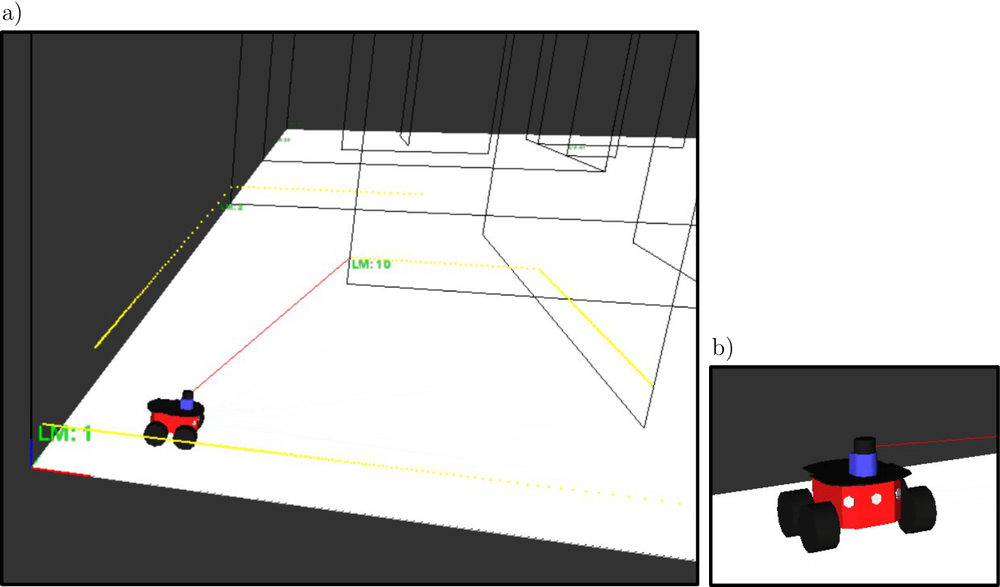
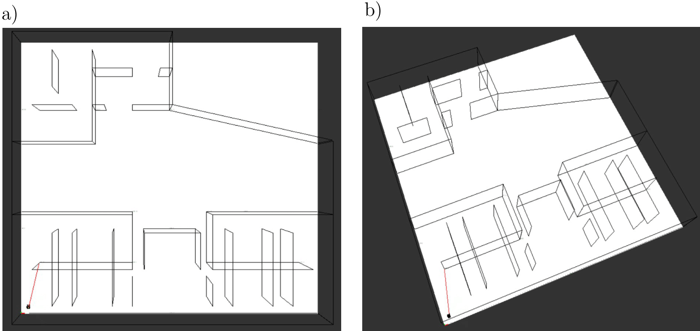
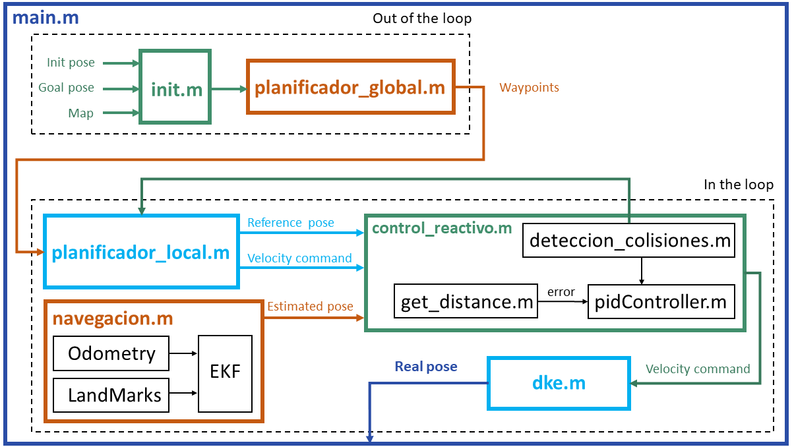

 

  
  <h3 align="center">Autonomous Surveillance Robot</h3>

  

    Robotic Navigation Strategies for a Nocturnal Surveillance Application
     
    <a href="https://github.com/albertoibernon/Autonomous_Surveillance_Robot/blob/main/project_report/Guiado_y_Navegacion.pdf"><strong>Explore the docs »</strong></a>
     
     
    <a href="#usage">View Demo</a>
    ·
    <a href="#contact">Contact</a>
  

<!-- TABLE OF CONTENTS -->

  
Table of Contents

  <ol>
    <li>
      <a href="#about-the-project">About The Project</a>
      <ul>
        <li><a href="#project-context-and-motivation">Project Context and Motivation</a></li>
        <li><a href="#objectives-of-the-project">Objectives of the Project</a></li>
        <li><a href="#software-architecture">Software Architecture</a></li>
      </ul>
    </li>
    <li><a href="#usage">Usage</a></li>
    <li><a href="#license">License</a></li>
    <li><a href="#contact">Contact</a></li>
  </ol>

<!-- ABOUT THE PROJECT -->
## About The Project

This work is part of the course of *Robot Guidance and Navigation* of the Master in Automatics and Robotics of the Polytechnic University of Madrid (UPM). It tries to familiarize the student with the task of **programming the navigation of a ground robot in the presence of uncertainties**.

### Project Context and Motivation

The problem selected is that of **a night watchman robot**. It is suggested as a potential system to be implemented in the *Museo Nacional del Prado* (in Madrid). It can, in our opinion, improve security and make the job of human guards easier. Depending on the number of robots used, a swarm of robots could provide continuous, complete, or nearly complete coverage given the size of the proposed museum.

The project will use *Matlab* for coding and programming, as well as *Apolo*, a simulator developed by the *Robotics and Automation Center* associated with the UPM. The simulators provides the possibility to be connected with Matlab and command a robot. *Marvin*, a Pioneer 3-AT type robot will be used for the simulator (see Figure 1.b), its locomotion system actually being that of a differential robot. Our research will only focus on a single robot, with the procedure being the same for all other swarm agents. Moreover, it will only be able to monitor one museum floor, with no way to go down or upstairs. Regarding the exteroceptive perception systems, ultrasonic sensors has been selected for reactive control and a laser (LIDAR) in point cloud mode for the localization, as seen in Figure 1.a. An additional proprioceptive system that is available is the robot's own odometry. The robot's localization will be made possible by the odometry and laser working together.

*Figure 1: Apollo simulations.*

This selection and the assumptions about the application have conditioned the map (the robot's navigation environment). As can be seen in Figure 2, it presents areas with narrow corridors, small rooms, but also wide spaces and oblique walls. In this way, we have tried to generalize the possibilities to be found in a real museum.

*Figure 2: Visualization of the map in Apolo.*

### Objectives of the Project

Once the application/problem requiring the navigation of a terrestrial robot has been chosen and the map of the environment to be worked on has been defined, we can establish the following objectives for the present work (see *project_report* for all the following chapters):

- By using a differential type locomotion system: determine the **uncertainty associated with the kinematic model** (Chapter 2).
- Chosen the **perception system**: **determine its uncertainty** by means of calibration (Chapter 2).
- For the **localization**: implement an algorithm that allows to obtain at any time the absolute position of the robot **using the Extended Kalman Filter**. Test and experiment with this algorithm to **analyze the influence of the parameters** and the goodness of the estimation achieved (Chapter 3).
- For the movement: **program a controller** that allows the robot to follow a defined trajectory. **Include a reactive control** that allows to avoid obstacles or to navigate through narrow places (Chapter 4).
- For trajectory generation: **integrate a planner** (Chapter 4).
- **Encapsulate everything** as a navigation algorithm as a proposal to the proposed application (Chapter 5).

### Software Architecture

The Robotic Navigation and Control has been implemented following a modular methodology that allows to perform individual regression tests to ease the validation process. It permits to distinguish the several parts involved in the project. It is structured in the following modules:

- **Init.m:** responsible for reading the initial and goal poses, inputs of the simulator. Then, the module places the robot real pose in the initial pose and resets the odometry. It also defines the sensors noise and estimation covariances. Finally, it initialize the time variables and the store matrices.
- **Planificador-global.m:** once the initial and goal poses are identified, the path planning module is executed to generate the waypoints that connect both points, based on RRT-star. This planification process is done off-line, previous to the running of the pseudo real-time (in-the-loop) code. The output of module is a matrix with the waypoints coordinates.
- **Planificador-local.m:** responsible to generate the intermediate reference points that the robot needs to chase between two waypoints during the in-the-loop execution. It permits path re-planning from the last estimated position to the next waypoint once the previous sequence of reference points has been completed, which enhances the success of the path chaser task. The module also extracts the derived forward and rotation velocities commands, computed when the reference points are correlated with the time. These commands are considered as an active control.
- **Navegacion.m:** responsible for taking the information from the proprioceptive (odometry) and exteroceptive (landmarks) sensors which are integrated in the Expanded Kalman Filter (EKF) to obtain the estimation pose and covariance matrices.
- **Control-reactivo.m:** responsible for taking the reference pose and the estimated pose, computing the error between them and extract reactive velocity commands, from a PI controller, which are added to the active commands. It also identifies the present of a close wall or obstacle from ultrasonic sensors and generates a robot rotation, proportional to the distance to the objects, to move away from them. Once, the objects are not detected, the robot performs a replanning, in case of needing.
- **Dke.m:** the simulator takes the control velocity commands and executes them in the Dynamics and Kinematic Environment (DKE), although only kinematic effects are considered for this approach. In this way, the real position and orientation are obtained.

*Figure 3: Robotic Navigation and Control software architecture.*

## Usage
The following is a short video demonstrating the operation of the developed project.

(<a href="#readme-top">back to top</a>)

<!-- LICENSE -->
## License

Distributed under the BSD 3-Clause License. See `LICENSE.txt` for more information.

(<a href="#readme-top">back to top</a>)

<!-- CONTACT -->
## Contact
Alberto Ibernón Jiménez - [albertoibernon](https://github.com/jbarciv) - alberto.ibernon@alumnos.upm.es\
David Redondo Quintero - [Drq13112](https://github.com/Drq13112) - david.redondo@alumnos.upm.es\
Josep Mª Barberá Civera - [jbarciv](https://github.com/jbarciv) - chemabc@gmail.com

(<a href="#readme-top">back to top</a>)

